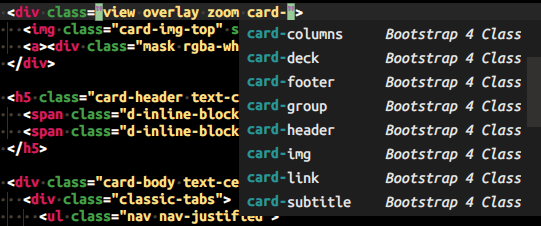

# ST-Bootstrap-4-Autocomplete

## Installation

This plugin is not published on Package Control (and probably never will be).

To install this plugin, you have better to: Add a custom Package Control repository.

1. Go to `Preferences` » `Package Settings` » `Package Control` » `Settings - User`.
1. Add custom repository and package name mapping as the following.

   ```javascript
   "package_name_map":
   {
     "ST-Bootstrap-4-Autocomplete": "Bootstrap 4 Autocomplete",
   },
   "repositories":
   [
     "https://github.com/jfcherng-sublime/ST-Bootstrap-4-Autocomplete.git",
   ],
   ```

1. Restart Sublime Text.
1. You should be able to install this package with Package Control with the name of `Bootstrap 4 Autocomplete`.
1. Once this plugin has been published on Package Control, you can remove above settings.

## Screenshots

Sublime Text 3



Sublime Text 4


## License

Forked and modified from [proficientdesigners/sublime-text-bs4-autocomplete](https://github.com/proficientdesigners/sublime-text-bs4-autocomplete)
because I don't like how they implement it after [my proposed PR](https://github.com/proficientdesigners/sublime-text-bs4-autocomplete/pull/3) has been rejected without no given reason.

This plugin is open-sourced under the [GPL license](https://www.gnu.org/licenses/gpl-3.0.en.html).
