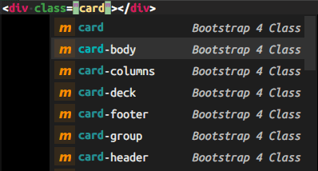

# ST-Bootstrap-4-Autocomplete

## Note

This plugin only supports ST 4.

## Installation

This plugin is not published on Package Control (and probably never will be).

To install this plugin via Package Control, you have to add a custom repository.

1. Execute `Package Control: Add Repository` in the command palette.
1. Add this custom repository: `https://raw.githubusercontent.com/jfcherng-sublime/ST-my-package-control/master/repository.json`
1. Restart Sublime Text.
1. You should be able to install this package with Package Control with the name `Bootstrap 4 Autocomplete`.

## Screenshots

## License

Forked and modified from [proficientdesigners/sublime-text-bs4-autocomplete](https://github.com/proficientdesigners/sublime-text-bs4-autocomplete)
because I don't like how they implement it after [my proposed PR](https://github.com/proficientdesigners/sublime-text-bs4-autocomplete/pull/3) has been rejected without no given reason.

This plugin is open-sourced under the [GPL license](https://www.gnu.org/licenses/gpl-3.0.en.html).
